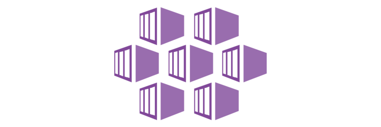

Lista de Conteúdos
=================
<!--ts-->
   * [Criação do Cluster AKS - Plugin de rede Azure CNI](https://github.com/luizpessol/aks-azure-kubernetes-services/blob/master/az_aks_create_cni_cli.md)
   * [Configurar Kubernetes Dashboard](https://github.com/luizpessol/aks-azure-kubernetes-services/blob/master/kubernetes_dashboard.md)
<!--te-->
<h1 align="center">
  
</h1>
